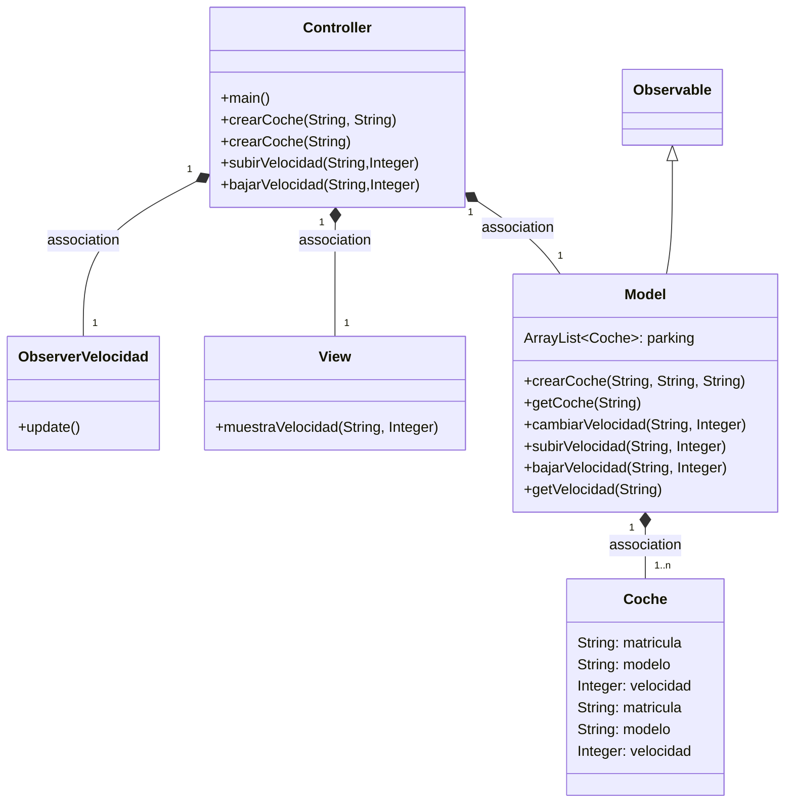
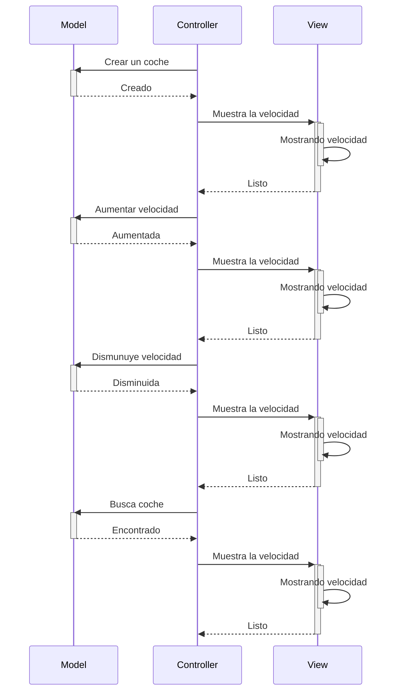
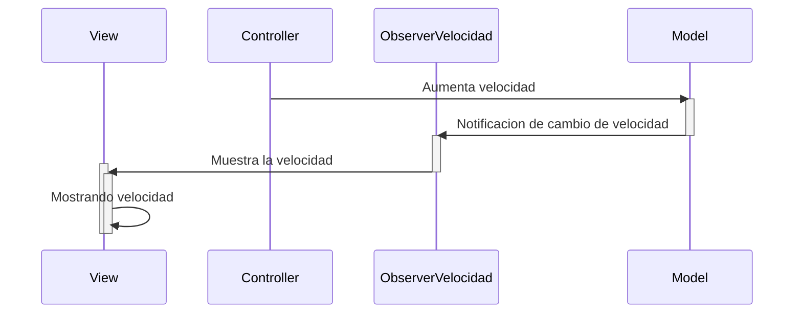

# Arquitectura MVC

Aplicación que trabaja con objetos coches, modifica la velocidad y la muestra.

En este caso se ha añadido un observer que detecta cuando se sobrepasan los 120km/h y lanza un jdialog que alerta de el exceso de velocidad.

---
## Diagrama de clases:

---

## Diagrama de Secuencia

Ejemplo básico del procedimiento, sin utilizar los nombres de los métodos

---

## Implementando observer:

El patrón Observer es como un sistema de notificaciones. Un objeto se registra para recibir actualizaciones automáticas cada vez que ocurre un cambio en otro objeto.

## Pasos para la configuración

1. Model:
    - Extender `Observable`
2. Metodos que debamos observar:
    - setChanged()
    - notifyObserver(valor)

3. Clase observer:
    - Crear método `update()`
3. Controller
    - Instanciar el observer.
    - Añadir este observer al observable con `addObserver()`

